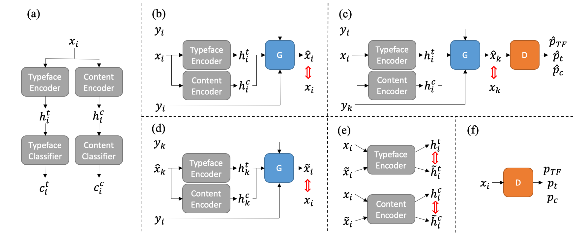
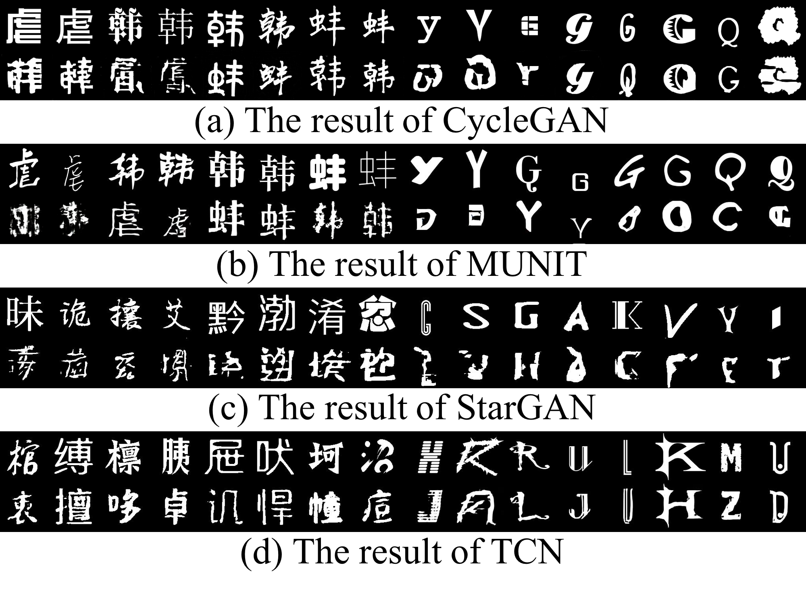
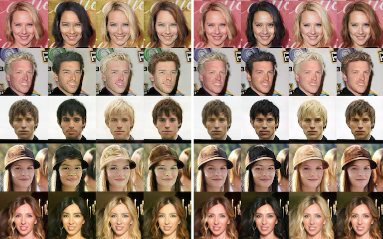

# 
Typeface Completion with Generative Adversarial Networks

## Abstract
The mood of a text and the intention of the writer can be reflected in the typeface. However, in designing a typeface, it is difficult to keep the style of various characters consistent, especially for languages with lots of morphological variations such as Chinese. In this paper, we propose a Typeface Completion Network (TCN) which takes one character as an input, and automatically completes the entire set of characters in the same style as the input characters. Unlike existing models proposed for image-to-image translation, TCN embeds a character image into two separate vectors representing typeface and content. Combined with a reconstruction loss from the latent space, and with other various losses, TCN overcomes the inherent difficulty in designing a typeface. Also, compared to previous image-to-image translation models, TCN generates high quality character images of the same typeface with a much smaller number of model parameters. We validate our proposed model on the Chinese and English character datasets, which is paired data, and the CelebA dataset, which is unpaired data. In these datasets, TCN outperforms recently proposed state-of-the-art models for image-to-image translation. The source code of our model is available at [this https URL](https://github.com/yongqyu/TCN).

## Paper
[Typeface Completion with Generative Adversarial Networks](http://arxiv.org/abs/1811.03762)  
[Yonggyu Park](https://github.com/yongqyu), [Junhyun LEE](https://github.com/LeeJunHyun), [Yookyung Koh](https://github.com/yookyungKoh), [Inyeop Lee](https://github.com/inyeoplee77), [Jinhyuk Lee](https://github.com/jhyuklee) [Jaewoo Kang](http://infos.korea.ac.kr/kang/)

## Task
### Typeface Comepletion
 
 Comparison of the output of TCN with that of the typeface transfer model. Unlike typeface transfer model that
 changes the style of an input, typeface completion model generates the contents of all character sets in the same style as the input. Typeface completion outputs are the results of TCN.

## Model
 
 The overall flow chart of the TCN. The red arrow refers to the loss from the difference. Encoders, G, and D share the same weights in all the experiments. (a) Encoder pretraining. (b) Identity loss. (c) SSIM loss comparing xˆk to xk, and adversarial loss leading to the result of the discriminator corresponding to xk. (d) Reconstruction loss that transforms xˆk to x˜i and compares it to the original xi. (e) Perceptual reconstruction loss. (f) Discriminator training.

## Results
### Character Image Style Transfer

 
The results of baselines and our model. The first row contains the typeface source image, the second row contains the output.

### General Image Style Transfer
 
The results of the style transfer for CelebA. The four columns on the left and the right are the results of StarGAN and TCN. The first column of each result is the input, and the remaining columns are the result of changing the domain label to black / blond / brown hair, respectively.

## Acknowledgments
Code is inspired by [StarGAN](https://github.com/yunjey/StarGAN)

