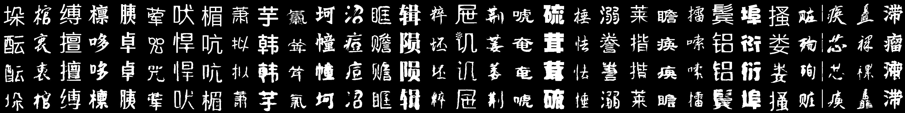
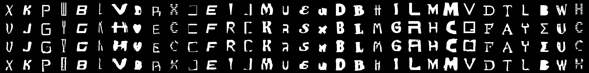
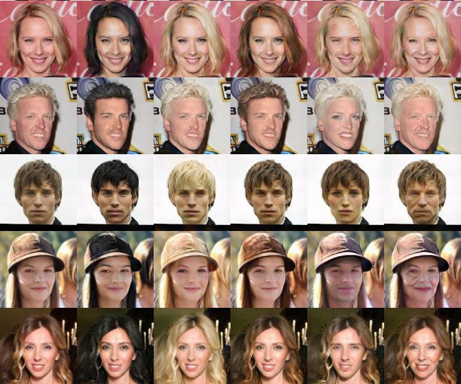

# 
Typeface Completion with Generative Adversarial Networks

## Abstract
  The mood of a text and the intention of the writer can be reflected in the
typeface. However, in designing a typeface, it is difficult to keep the style
of various characters consistent, especially for languages with lots of
morphological variations such as Chinese. In this paper, we propose a Typeface
Completion Network (TCN) which takes a subset of characters as an input, and
automatically completes the entire set of characters in the same style as the
input characters. Unlike existing models proposed for style transfer, TCN
embeds a character image into two separate vectors representing typeface and
content. Combined with a reconstruction loss from the latent space, and with
other various losses, TCN overcomes the inherent difficulty in designing a
typeface. Also, compared to previous style transfer models, TCN generates high
quality characters of the same typeface with a much smaller number of model
parameters. We validate our proposed model on the Chinese and English character
datasets, and the CelebA dataset on which TCN outperforms recently proposed
state-ofthe-art models for style transfer. The source code of our model is
available at https://github.com/yongqyu/TCN.

## Paper
[Typeface Completion with Generative Adversarial Networks](http://arxiv.org/abs/1811.03762)  
[Yonggyu Park](https://github.com/yongqyu), [Junhyun LEE](https://github.com/LeeJunHyun), [Yookyung Koh](https://github.com/yookyungKoh), [Inyeop Lee](https://github.com/inyeoplee77), [Jaewoo Kang](http://infos.korea.ac.kr/kang/)

## Results
### Character Image Style Transfer

Chinese 
 
English 
 

### General Image Style Transfer
 

## Acknowledgments
Code is inspired by [StarGAN](https://github.com/yunjey/StarGAN)
